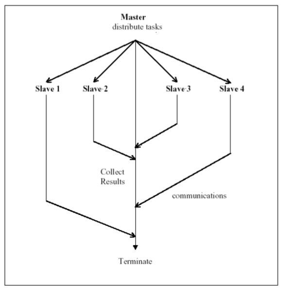

# Parallel and Distributed Computing

# Overview

Vertical scaling: have faster processors  
Horizontal scaling: have more processors

Types of parallel:

* single machine multipule cores
* loosely coupled cluster of machines
	* Seti@home
* Tightly coupled clusters
	* HPC, servers in a room
* widely distributed clusters of machines ???
* hibrid

## Limitations:

#### Amdahl's Law

$$
	T(1) = \sigma + \pi \quad \quad T(N) = \sigma + \frac{\pi}{N}
$$

where $\sigma$ is the **amount of work** that cannot be parallelized; $\pi$ is the **amount of work** that can be parallelized. And $\sigma + \pi = 1$

So we have speedup

$$
	S(N) = \frac{T(1)}{T(N)} = \frac{\pi + \sigma}{\sigma + \pi / N} = \frac{1+\pi/\sigma}{1+(\pi/\sigma)/N}
$$

let the **fraction of serial work** is $\alpha$, then the **fraction of parallelized work** is $1 - \alpha$

then we have $\pi / \sigma = (1-\alpha)/\alpha$

then we have

$$
	S(N) = \frac{1 + (1-\alpha)/\alpha}{1+(1-\alpha)/\alpha N} = \frac{1}{\alpha+(1-\alpha)/N} \approx \frac{1}{\alpha}
$$

Meaning: if the **fraction** of serial **work** is fixed and the problem size is fixed, then the speedup is limited.

---

#### Gustafson-Barsis's Law (calculaton???)

$$
	T(1) = \sigma + N \pi \quad \quad T(N) = \sigma + \pi
$$

$$
	S(N) = \alpha + N(1-\alpha) = N - \alpha (N-1)
$$

$\alpha$: fraction of running time sequential program **speeds on** parallel parts.

For example, a parallel program takes 120s to run, and the total time spend in the sequential part was 12s. Then $\alpha=12/120$

---

### Approaches for Parallelism

#### Explicit vs Implicit Parallelisation

* Implicit Parallelism
	* supported by parallel languages and parallel compilers
* Explicit Parallelism
	* the programmer is responsible for most of the parallelisation effort
	* assumes user is the best judge

### Parallelisation Paradigms
* Task-farming / master-worker   
	
	* Master decomposes the problem into smaller tasks, distributs to workers and gathers partial results to produce the final result
	* Realised in many ways of different levels of ==granularity==, e.g. threads through to web service workflow definition and ==enactment==.
* Single-program multiple-data   
	
	* Commonly exploied model
		* ==Bioinformatics==, MapReduce, ...
	* Each process executes the same piece of code, but on different parts of the data
	* Data is typically split among the available procs
	* Data splitting and analysis can be done in many ways
	* Assignment 1
* Pipeling   
	
* Divide and Conquer   
	
	* A problem is divided into two or more sub problems. Each of these sub problems are solved independently and their results are combined
	* 3 operations: split, compute and join
	* Master-worker is like divide and conqure with master doing both split and join
* Speculation: very complex, can't understand...
* Parametric Computation: never seen in the slides

### Erroneous Assumptions of Distributed Systems (Problems that hard to deal with)

1. The network is reliable
2. Latency is zero
3. Bandwidth is infinite
4. The network is secure
5. Topology doesn't change
6. There is one administrator
7. Transport cost is zero
8. The netowrk is homogeneous
9. The time is _ubiquitous_ (Because there is no global time)

### Distributed System Challenges

* Complexity of implementations
	* Middleware bloat and lock-in
	* Vision and challenges of reality
* Vendor specific solutions
* Scale of the problem area
