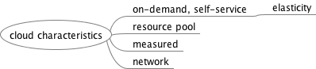

# Cloud

## What is cloud computing

Cloud computing is a kind of ==Internet-based computing== that provides shared processing resources and data to computers and other devices ==on demand==.

## What is the difference between Cloud, Grid and Cluster? 

> Warning!
> 
> Copied from StackOverflow. (These can also be found in ADB slides)

Cluster differs from Cloud and Grid in that a cluster is a group of computers ==connected by a local area network (LAN)== **(Spartan)**, whereas cloud and grid are more wide scale and can be ==geographically distributed==. Another way to put it is to say that ==a cluster is tightly coupled==, whereas a Grid or a cloud is loosely coupled. 

The difference between a cloud and a grid can be expressed as below:

* Resource distribution: Cloud computing is a ==centralized model== whereas grid computing is a ==decentralized model== where the computation could occur over many administrative domains.
* Ownership: A grid is a collection of computers which is ==owned by multiple parties in multiple locations== and connected together so that users can ==share== the combined power of resources. Whereas a cloud is a collection of computers usually ==owned by a single party==.

## History （how we got there）

> There may be some problems because I don't fully understand the slides...

1. Centralised system
	* Single physical system. All resources are fully shared and tightly coupled within one integrated OS. (Time sharing???)
2. Parallel system
	* All procs eighter tightly coupled with centralised shared memory (multi-cores, OpenMP) or loosely coupled with distributed memory (MPI). Interprocess communication throught shared mem or message passing.
3. Distributed system
	* Multiple _autonomous_ computers with their own private memory, communicating through message passing over a computer network.
	* computer to computer interaction focus
	* heterogeneity
4. Grid computing
	* organization to organization focus

(Cloud computing is centralised again to some extent (data centre))

## Motivation
* Cost-benifits: flexibility
* Simplicity: providers will take care of hardware.

## Flavours of Cloud

### Delivery models

* On-premises
* IaaS
* PaaS
	* GAE
* SaaS
	* Gmail, Office 365

#### Essential Characteristics

* _On-demand_ self-service
* Broad network access 
* Resource pooling (don't have fixed set of resources)
* Rapid elasticity
* Measured service (Determines how you pay the money)

### Deployment models

* Public clouds
	* pros
		* utility computing   
			提供服务的模型，在这个模型里服务提供商提供客户需要的计算资源和基础设施管理，并根据应用所占用的资源情况进行计费，而不是仅仅按照速率进行收费。
		* (users can) focus on core business
		* cost-effective
		* right sizing
		* democratisation of computing (Users decide what service they want)
	* cons
		* security
		* loss of control
		* possible lock-in
		* dependency of cloud provider continued existence

* Private clouds
   * pros  
      * Control
      * consolidation of resources
      * easier to secure
      * more trust
	* cons
		* core business irrelevent
		* staff/management overheads
		* hardware obsolescence
		* over/under utilization challenges
* Hybrid clouds  
   * pros: 
      * cloud-bursting: use private cloud, but burst into public cloud when need  
   * cons:
      * how to move data/resources when needed
      * don't know when to burst into public and what data can go to public cloud
      * don't know public cloud compliant with PCI-DSS ( Payment Card Industry- Data Security Standard)

# Practice

## Deployment - virtual image vs scripting

### Virtual image

Deploying complex cloud system requires alot of moving parts

* Easy to forget what software you installed and what steps you took to configure system.
* Might be non-repeatable

Virtual images are monolithic. (You don't have to recall what softwares to install, simply take a snapshot. But images can be large, space consuming.) Also they don't provide record of changing.

### Scripting

* Provides a record of what you did
* codifies knowledge about system
* make process repeatable.
* make it programmable (but need to take more efforts)