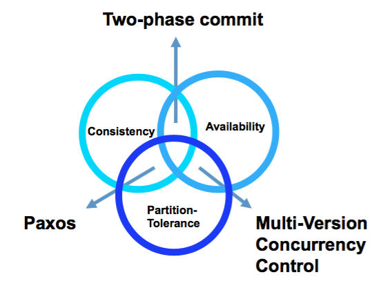

# Big data

## What

The 'Vs':

* Volume: the size of data
* Velocity: the frequency of new data being brought in to the system and analysis performed
* Variety: the variability and complexity of data schema.
* ==Veracity==(精确性): the level of trust in the data accuracy; the more diverse sources you have, the more _unstructured_ they have, the less veracity you have.

## The CAP theorem

* Consistency   
	Every client receiving an answer receives _the same answer_ from all nodes in the cluster
* Availability   
	Every client receives _an answer_ from any nodes in the cluster
* Partition-tolerance
	The cluster keeps on operating when one or more nodes cannot communicate with the rest of the cluster
	

### Consistency and availability -- Two phase commit

* locking data that are within the transaction scope
* performing transactons on WAL
* completing trnsactions commit only when all nodes in the cluster have performed the transaction (voted yes)
* abort transactions when a partition is detected ???

* reduced availability (locking)
* enforced consistency

No partition torlerance: if one node crashes, then the coordinator will abort the transaction.   
A good solution when the cluster is co-located, less good when it is distributed.

### Consistency and partition-tolerance -- Paxos

### Availability and Partition-tolerance -- Multi-Version concurrency control

* concurrent updates are possible without distributed locks, since the updates will have different revision numbers. (in ==optimistic locking== only)
* Coarse-grained DBMS models fit the optimistic locking of the MVCC method, since the number of transactions is less than in a comparable relational design.