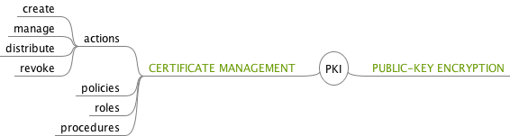
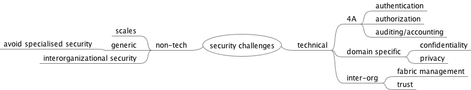

# Terms

* Single sign-on: allow users to access multiple services with a single login。
* PKI: is a set of roles, policies, and procedures needed to create, manage, distribute, use, store, and revoke digital certificates and manage public-key encryption.   
	
* CA: is a ==trusted entity== that ==issues== electronic documents that verify a digital entity's identity on the Internet. 
* Registration authority: is an authority in a network that ==verifies user requests== for a digital certificate and tells the certificate authority (CA) to issue it. 
* Identity Provider: providing identifiers for users looking to interact with a system. (Facebook in SSO)

# Security Challenges

## Technical

* Authentication
* Authorization
* Audit/accounting
* Confidentiality
* Privacy
* Trust
* Fabric management

## Non-technical

* Need to support security that scales
* Avoid inventing specialised security, make it generic, easily to apply
* Inter­organisational security
	* Restrict access to certain users
	* Changing policies over time
	* Sharing resources with noisy neighbours

# Authenticaton

Authentication is ==the establishment and propagation== of a user’s ==identity== in the system. (Prove who you are) (Doesn't check what user is allowed to do (this is achieved by authorization))

Traditionally: username / password

Solution on clouds: Public Key Infrastructure (PKI)

# Public Key Cryptography

https://en.wikipedia.org/wiki/Public-key_cryptography

Benefits: Public Key Cryptography simplifies key management. Users don’t need to have many keys for long time.

# Shibboleth and Federated Identity (Single Sign-On / Decentralized Authentication) 

Single Sign-on (SSO) allows users to access multiple services with a single login. (e.g. 微博一键登录)

Federated Identity (FID) refers to where the user stores their credentials. Alternatively, FID can be viewed as a way to ==connect Identity Management systems together==. In FID, a user's credentials are always stored with the =="home" organization (the "identity provider")==. When the user logs into a service, instead of providing credentials to the service provider, ==the service provider **trusts** the identity provider to validate the credentials.== So the user never provides credentials directly to anybody but the identity provider.

## Benefits

* simple for users, single password, single sign-on to web-based resources
* standardised

## Drawbacks (Security problems)

* policy/attributes statically agreed across federation
* no finer grained access control
* only for academics (Shib)
* trust

---

# Authorization

Authorisation is concerned with controlling access to resources based on policy.